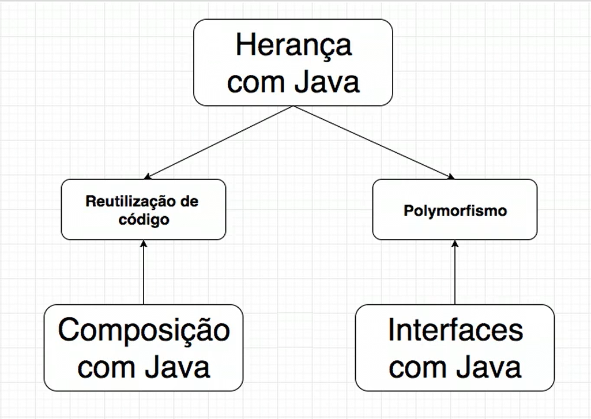

# Java Polimorfismo: entendendo herança e interfaces

## Introdução Herança
Ao utilizar a herança, a classe filha herda todos os atributos (caracteristicas) e métodos (funcionalidades) da classe mãe.
 Palavra chave: extends. 
Benefício: Reutilização de código e polimorfismo.

## Super e reescreita ou sobrescrita de métodos
* Super: É utilizado na classe filha para nos referenciarmos a atributos ou métodos da classe mãe. 

* Reescreita ou sobrescrita de métodos: É um conceito importante na herança que redefine um comportamento de um método da classe mãe através da filha.  
É utilizado quando temos de ter um comportamento do método mais específicos.

## Polimorfismo
É o princípio pelo qual duas ou mais classes derivadas de uma mesma superclasse podem invocar métodos que tem a mesma identificação (assinatura) mas comportamentos distintos, especializados para cada classe derivada, usando para tanto uma referência a um objeto do tipo da superclasse.  
`-` Atráves de uma classe genérica conseguimos nos comunicar com outros objetos. 
`-` Benefício: Desacoplar o sistema e Conseguir se comunicar com tipos de objetos diferentes a partir da mesma referencia genérica. 

## Herança e o uso de construtores
Os construtores pertencem somente a própria classe, ou seja, não herdamos construtores da classe mãe, porém podemos chamá-lo através do super. 
super é uma variável que é usada para chamar métodos, e para acessar o construtor de superclasse.  
`-` Herança simples: extende apenas uma classe 
`-` Herança múltipla: Não existe em Java

## Classes e métodos abstratos
* Classes abstratas: Utilizado quando a classe não é concreta Ex: Funcionário, Conta, Automóvel...
Note que para cada exemplo citado acima podemos ter classes mais especificas (concretas) Ex:Funcionario -> Desenvolvedor, ou seja, representam um conceito.
 OBS: Ao utilizar classes abstratas não podemos instanciá-la.

* Métodos abstratos: Utilizado quando não existe nenhuma implementação padrão e ao utilizar um método abstrato "forçamos" as classes filhas (concretas) implementarem esse método conforme regra de negócio.
 Um metodo abstrato não tem corpo somente assinatura (visibilidade, retorno, nome do método e parâmetro)

## Interfaces
* É um contrato onde quem assina se responsabiliza por implementar esses métodos (cumprir o contrato)
* É uma classe abstrata, com todos os métodos abstratos;
* Dentro de uma interface não tem nada concreto.
* interfaces são uma alternativa a herança referente ao polimorfismo, o que a herança não consegue resolver a interface resolve. 

#### Benefício: 
- [X] Garante que todos os métodos de classes que implementam uma interface possam ser chamados com segurança, não havendo confusão como se houvesse uma herança múltipla.

### Modificadores de acesso:
* Private: Apenas visível dentro da própria classe
* Protected: Visível na própria classe e também na classe filha
* Public: Visível em todo o lugar.

### Boas práticas
* this se referencia ao atributo da classe, então havendo uma herança a classe filha não deverá utilizar o this para acessar o atributo da classe mãe e sim o super, assim deixamos explito que aquele atributo ou método vem da classe mãe. 

* Dependendo do design utilizado não se deixa os atributos visiveis nem para os filhos

### Esclarecimento
* this:
<strong>Quando instaciada uma classe, temos um objeto, nesse ponto ao utilizarmos o this em um método para se referenciar a um atributo, estamos nos referenciando ao atributo do objeto que está sendo executado no momento.</strong>
___
### Imagem / Resumo de quando utilizar cada mecanismo:

Utilidade dos mecanismos: 
* Utilizamos a herança quando necessitamos dos dois beneficios que a herança nos propoe a Reutilização de código e polimorfismo. 
* Utilizamos a composição quando somente necessitamos do benefício da reutilização de código. 
* Utilizamos a interface quando somente necessitamos do benefício do polimorfismo.