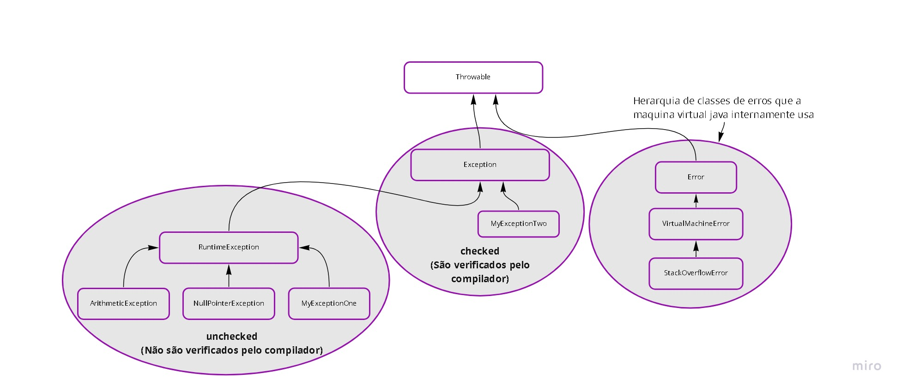

# Java Exceções

## Pilha de execução
A JVM usa uma stack para organizar a execução dos métodos e para entendermos o rastro de exceção. 
A JVM sabe exatamente  qual método está sendo executado que é sempre o método no topo da pilha e também sabe quais outros precisam ser executados que são os métodos abaixo.

## Tratamento de exceções
`-` Uma exceção em Java é um objeto da classe java.lang.Exception, ou de uma de suas subclasses. 
`-` Exceção é um evento não esperado que ocorre no sistema quando está em tempo de execução 
`-` Exceções servem para: 
* impedir a parada de execução prematura do código, 
* capturar o erro/exceção e 
* delegar o tratamento deste erro para alguma parte específica do código (classe)

#### Try Catch
> Utilizamos try catch para lidarmos com exceções e voltar para uma execução normal

Com o try alertamos a maquina virtual e com o catch definimos qual exceção pode acontecer

## Lançamento de exceções
### throw 
o Java pega esse objeto que esta no HEAP (memória de objetos), transforma em uma exceção e "joga" na pilha de execução. 
> O Java reconhece que, quando jogamos uma exceção, saímos abruptamente do código pos isso se houver código abaixo o compilador acusa-rá erro.

## Checked e Unchecked

* Existe uma hierarquia grande de classes que representam exceções. Por exemplo, ArithmeticException é filha de RuntimeException, que herda de Exception, que por sua vez é filha da classe mais ancestral das exceções, Throwable. Conhecer bem essa hierarquia significa saber utilizar exceções em sua aplicação.
* Throwable é a classe que precisa ser extendida para que seja possível jogar um objeto na pilha (através da palavra reservada throw)
* É na classe Throwable que temos praticamente todo o código relacionado às exceções, inclusive getMessage() e printStackTrace(). Todo o resto da hierarquia apenas possui algumas sobrecargas de construtores para comunicar mensagens específicas
* A hierarquia iniciada com a classe Throwable é dividida em exceções e erros. Exceções são usadas em códigos de aplicação. Erros são usados exclusivamente pela máquina virtual. Classes que herdam de Error são usadas para comunicar erros na máquina virtual. Desenvolvedores de aplicação não devem criar erros que herdam de Error
* StackOverflowError é um erro da máquina virtual para informar que a pilha de execução não tem mais memória.
* Exceções são separadas em duas grandes categorias: aquelas que são obrigatoriamente verificadas pelo compilador e as que não são verificadas. As primeiras são denominadas checked e são criadas através do pertencimento a uma hieraquia que não passe por RuntimeException. As segundas são as unchecked, e são criadas como descendentes de RuntimeException.

### Quando utilizar checked ou unchecked
`-` Se algumas exceções podem ocorrer e quiser avisar a quem for utilizar que faça um tratamento, utilize checked. 
`-` Se não há necessidade ou mais flexibilidade e acredita-se que o desenvolvedor pode fazer o tratamento quando ele achar melhor, use unchecked.

### Benefício das Exceptions
- [x] Exceções tem um nome e, caso esse nome seja expressivo, documenta o problema que está ocorrendo.

- [x] Exceções podem ter uma mensagem, ou seja, o problema e o estado das variáveis podem ser descritos na mensagem.

- [x] Exceções mudam o fluxo de execução, ou seja, evitam que o problema siga o fluxo "normal" quando algo excepcional acontece.

- [x] Exceções podem ser tratadas, ou seja, podemos voltar para a execução "normal" caso o "problema" esteja resolvido.

